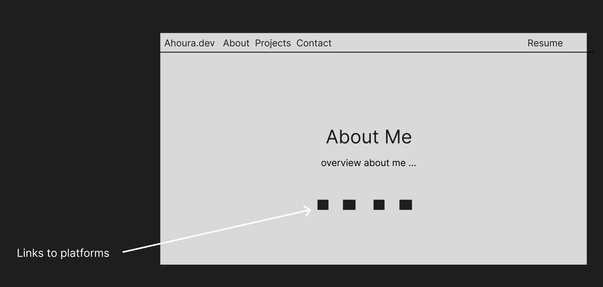
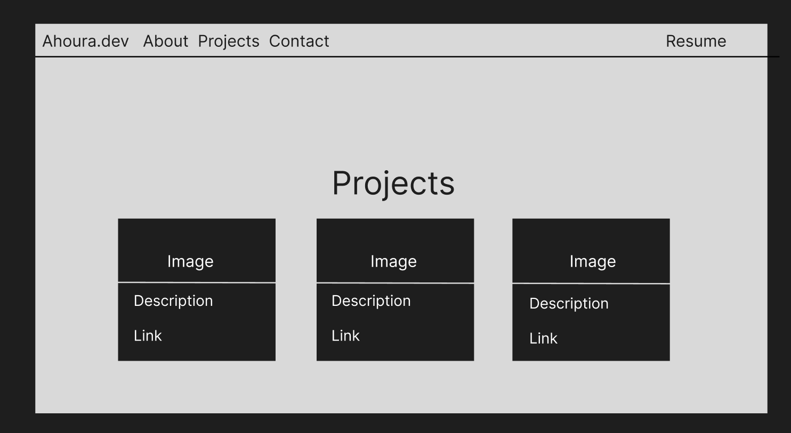
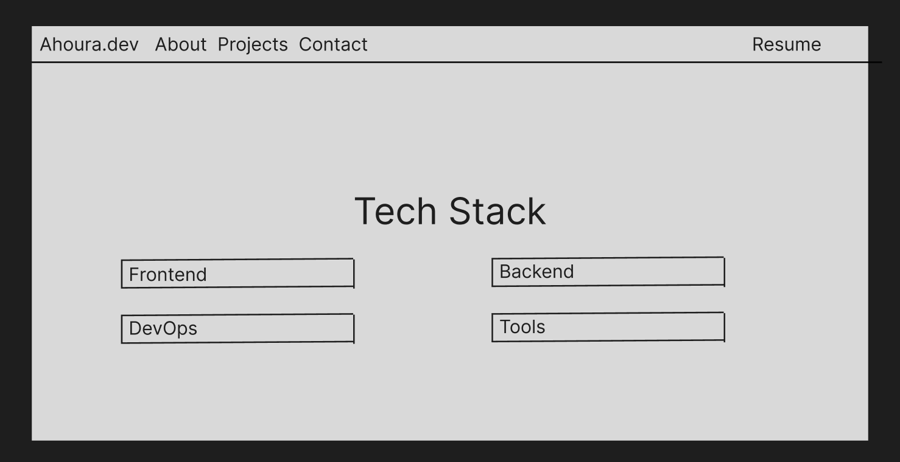
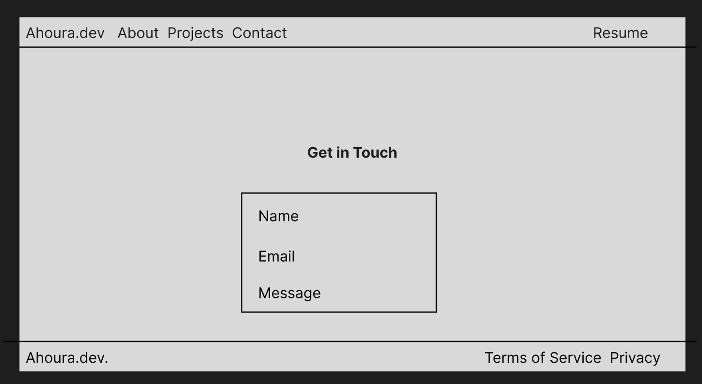

# Ahoura's Portfolio Website

This is my personal portfolio website built with **Next.js**, **React**, and **Tailwind CSS**. It showcases my **projects, skills, and contact information** as a computer science student at **Simon Fraser University (SFU)**.

## License justification

I chose the Unlicense because it fully gives my work to the public domain, allowing anyone to use, modify, or distribute it without restrictions. This ensures complete freedom for developers while eliminating any legal barriers.

## Features
-  **About Me** – Introduction to my background and interests.
-  **Projects** – A collection of my work with descriptions and links.
-  **Tech Stack** – Technologies I use.
-  **Contact Form** – A simple way for visitors to reach me.
-  **Responsive Design** – Works on all devices.

## Tech Stack
- **Next.js** – Framework for React applications.
- **React** – Component-based UI development.
- **Tailwind CSS** – CSS framework.
- **GitHub Pages** – Hosting for deployment.


## Setup
Clone the repository:
   ```bash
   git clone https://github.com/how-to-speall/how-to-speall.github.git
   cd howt-to-speall.github.io

   Install dependencies:
   npm install

   Run locally:
   npm run dev
```
## Live Demo
[how-to-speall.github.io](how-to-speall.github.io)

## Wireframe
[Figma page](https://www.figma.com/design/dQ89fnoRy3XuUeg2E8eEIg/CMPT-276-mini-project?node-id=0-1&t=0Norrhl2h1jy1ksX-1)

### **About Me**


This wireframe represents the **About Me** section of the portfolio. At the top there is a **navigation bar** containing links to different sections of the site (**About, Projects, Contact**) and a button labeled **Resume**.  

In the main area the section is **"About Me"** followed by a short **overview** of me. Below the text there are **four square icons**, which serve as **links to external platforms** (such as GitHub, LinkedIn, Twitter, and email). This section introduces me and provides an easy way for visitors to find more about me.

---

### **Projects**


This wireframe showcases the **Projects** section of the portfolio. The navigation bar remains consistent at the top ensuring easy access to other sections.  

The main section is labeled **"Projects"** and contains a **grid layout** of three project cards. Each project card consists of:  
- A **image** representing the project  
- A **description** of the project  
- A **link** to the project repository

---

### **Tech Stack**


The **Tech Stack** section displays the technologies and tools used by me.  

At the center, a bold title **"Tech Stack"** introduces the section. Below, there are four labeled categories in separate boxes:
- **Frontend**  
- **Backend**  
- **DevOps**  
- **Tools**  

Each category represents a different aspect of expertise, helping visitors understand the technologies I am proficient in.

---

### **Contact Me**


This wireframe represents the **Contact Me** section, where visitors can reach out.  

At the top, the **navigation bar** remains visible. The section features a **title** that says **"Get in Touch"**, followed by a **contact form** with fields for:
- **Name**  
- **Email**  
- **Message**  

At the bottom of the page there is a **footer** with links to **Terms of Service** and **Privacy Policy**.

---


